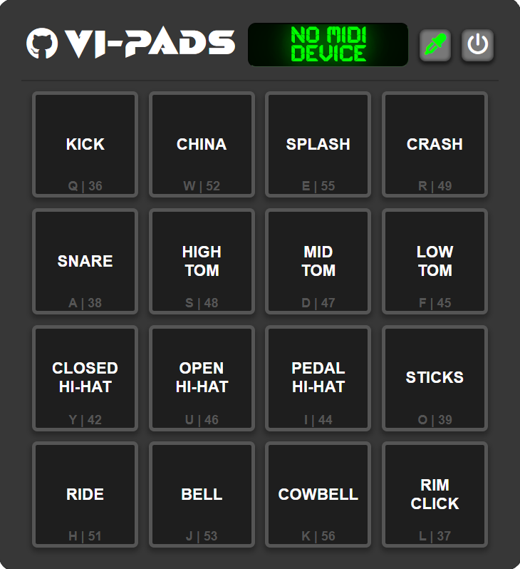

# VI-Pads 🔳

## Table of Contents

- [Description](#description)
    - [Project](#project)
    - [Repository](#repository)
    - [Technical Details](#technical-details)
- [User Interface](#user-interface)
- [License](#license)

## Description

### Project
**VI-Pads** interacts with touch, mouse, keyboard, and MIDI events to play back preloaded drum samples, utilizing the *Web Audio API* and the *Web MIDI API* as the core building blocks for audio control and MIDI functionality. This virtual drumpad features 16 illuminated pads, a touchscreen for switching between connected MIDI controller inputs, a color picker button to change the light color, and a power button to turn the device on and off. You can watch a video demonstration of this virtual drumpad at the following [link](https://youtu.be/atA1x9nA8OI) or try it yourself on the *GitHub Pages* [site](https://mogeadis.github.io/VI-Pads/) of this project.

### Repository
The code in this repository is organized into three main files, namely [`index.html`](index.html), [`style.css`](style.css), and [`script.js`](script.js), along with a set of *JavaScript* [Modules](Modules), which break down the functionality of the project into more manageable and maintainable components. The [Files](Files) directory contains a couple of images and a collection of drum [Samples](Files/Samples), which were gathered from various royalty-free web sources for this project. 

### Technical Details
This project was developed using `HTML5`, `CSS3`, and `JavaScript ES6`, and was thoroughly tested on *Microsoft Edge*, *Google Chrome*, *Mozilla Firefox*, and *Safari* web browsers available on `Windows 10`, `Android 12`, and `iOS 17` devices. The *Web Audio API* is supported by all of these browsers, however *iOS* devices need *Silent Mode* to be switched off to allow audio playback. The *Web MIDI API* is fully supported by *Microsoft Edge* and *Google Chrome*, partially supported by *Mozilla Firefox*, and not supported at all by *Safari*. Specifically, *Mozilla Firefox* offers only desktop support, however it does not detect when a MIDI controller is connected or disconnected, thus requiring the device to be already connected to the computer before loading the web page in order for it to be recognized. Lastly, note that *iOS* devices do not support the *Web MIDI API* on any browser.

## User Interface

## License

*VI-Pads* © *2024* by *Alexandros Iliadis* is licensed under the [GNU General Public License v3.0](https://choosealicense.com/licenses/gpl-3.0/).

Permissions of this strong copyleft license are conditioned on making available complete source code of licensed works and modifications, which include larger works using a licensed work, under the same license. Copyright and license notices must be preserved. Contributors provide an express grant of patent rights.

See the [LICENSE.md](LICENSE.md) file for more details.